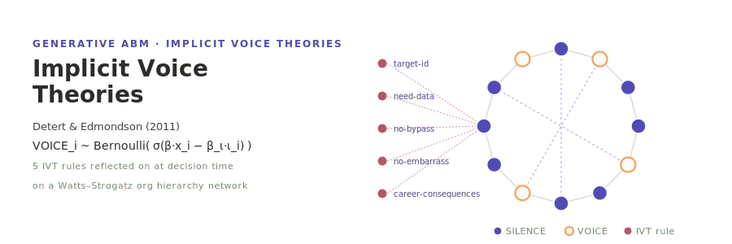

<p align="center"></p>

**English** | [日本語](README.ja.md)

# Detert & Edmondson (2011) — Implicit Voice Theories

A generative agent-based replication of **Detert & Edmondson (2011), "Implicit Voice Theories: Taken-for-Granted Rules of Self-Censorship at Work"** (*Academy of Management Journal*, 54(3), 461–488; DOI: 10.5465/AMJ.2011.61967925).

Employees on a Watts–Strogatz organisational network decide, each step, whether to **VOICE** an upward concern or stay **SILENT**. Before deciding, every agent reflects on the paper's **five Implicit Voice Theory (IVT) rules**:

1. **target_id** — presumed target identification (the boss takes input as a personal attack),
2. **need_data** — need solid data or a finished solution before speaking,
3. **no_bypass** — don't go over your supervisor's head,
4. **no_embarrass** — don't embarrass the boss in public,
5. **career_consq** — negative career consequences of speaking up.

Three **mutually exclusive** decision modes are selected with `--llm-mode`:

- `llm` — an LLM (`socsim-llm`, Ollama-first → OpenAI fallback) decides VOICE/SILENCE, the silence motive, and which IVT rules fired, given a persona and the local context; the five rules are embedded as a **self-reflection layer** in the prompt.
- `rule` — the §4.3 VOICE logit `σ(β0 + β_ψ ψ + β_u u + β_σ σ − β_f f − β_ι ι − β_C ρ + β_θ·cascade)` with the full IVT main-effect term `−β_ι ι`.
- `rule_no_ivt` — the same logit with `β_ι = 0` (the IVT ablation that isolates the causal contribution of the Implicit Voice Theory term).

The `rule` / `rule_no_ivt` modes make **zero LLM calls** and reproduce bit-for-bit.

## Two-layer determinism

LLM output is **outside** socsim's bit-reproducibility, so the design splits into two layers:

- **Deterministic socsim core** — employee initialisation, Watts–Strogatz network generation, scheduling, the eight non-decision mechanisms, and both rule-mode logits. Given a seed this reproduces bit-for-bit.
- **Non-deterministic LLM layer** — the `voice_decision` mechanism only. Pseudo-determinised by `socsim-llm`'s `CachingClient` (a `hash(prompt+model)` → response cache), `temperature=0`, and a fixed `(agent_id, t)`-derived seed. The cache — not the model — is the reproducibility mechanism: a warm cache replays identical responses.

Each run writes `llm_meta.json` recording mode / model / endpoint / temperature / seed / cache-hit rate.

## Install & Quick start

```bash
# Build the Rust simulation (fetches socsim incl. socsim-llm with Ollama+OpenAI backends).
cargo build --release

# === HiCo 50% calibration (rule mode — no LLM) ===
cargo run --release -- run \
    --n 200 --n-teams 8 --team-size 25 --n-levels 3 \
    --network-model watts-strogatz --network-k 6 --network-beta 0.1 \
    --ivt-mean 0.55 --ivt-sd 0.20 \
    --beta-psafety 1.2 --beta-fear 1.5 --beta-ivt 2.0 \
    --llm-mode rule --t-max 60 --runs 1 --seed 42

# === LLM mode (Ollama first) ===
#   ollama pull llama3.1
export OLLAMA_HOST=http://localhost:11434
export OLLAMA_MODEL=llama3.1
cargo run --release -- run --llm-mode llm \
    --cache-path runs/detert_cache.json \
    --t-max 60 --runs 1 --seed 42

# === Sensitivity sweep (β_ι × ψ̄ phase diagram) ===
cargo run --release -- sweep \
    --beta-ivt-min 0.0 --beta-ivt-max 1.6 --beta-ivt-step 0.2 \
    --psafety-mean-values 0.3,0.5,0.7 \
    --runs 30 --seed 42

# === Ablation: IVT necessity (rule vs rule_no_ivt) ===
cargo run --release -- ablation --modes rule,rule_no_ivt --seed-start 0 --seed-end 30

# === Per-mode anchor report ===
cargo run --release -- reproduce --llm-mode rule --t-max 60 --runs 30

# Python visualization & analysis tools (workspace root)
uv sync
uv run detert-tools visualize                 # silence series + IVT rule heatmap + scatter
uv run detert-tools visualize-sweep           # β_ι × ψ̄ phase diagram
uv run detert-tools show-experiment-settings  # config / sweep_config / llm_meta
uv run detert-tools reproduce                 # Table-4-style report + CFA-style fit indices
```

## Repository layout

```
detert2011/
├── simulation/                       # Rust socsim ABM
│   ├── Cargo.toml                    # socsim-{core,engine,net,llm,results} git deps
│   ├── src/
│   │   ├── lib.rs / main.rs          # CLI: run / sweep / ablation / reproduce
│   │   ├── config.rs                 # Config / LlmMode / BetaGroup / NetworkKind
│   │   ├── world.rs                  # SilenceWorld + Employee + Team + IvtRule + Motive
│   │   ├── mechanisms.rs             # 9 mechanisms × 6 phases; rule vs LLM decision (exclusive)
│   │   ├── prompts.rs                # IVT 5-rule self-reflection prompt + decision JSON parser
│   │   ├── llm.rs                    # socsim-llm shared-harness re-export shim
│   │   ├── simulation.rs             # init_world + run_with_client + CSV/JSON writers
│   │   └── metrics.rs                # upward_silence / rule_activation / co-occurrence / corr
│   └── tests/integration_test.rs     # rule bit-determinism + scripted-LLM smoke
├── tools/                            # Python detert-tools
│   └── src/detert_tools/{cli,visualize,visualize_sweep,show_experiment_settings,
│                         reproduce_paper}.py
├── docs/                             # bilingual: architecture, cli, usecases, visualization, reproduction
└── results/                          # runtime outputs (gitignored)
    ├── latest -> {YYYYMMDD_HHMMSS}/
    └── {YYYYMMDD_HHMMSS}/
        ├── config.json | sweep_config.json
        ├── metrics.csv               # t, upward_silence_rate, rule_*, max_rule_cooccurrence, …
        ├── agents.csv                # final-step per-agent state + active_rules
        ├── rule_activation.csv       # per-step per-rule firing share
        └── llm_meta.json             # LLM provenance + cache-hit + silence_voice_corr
```

## Documentation

- [Architecture](docs/architecture.md) — world state, 9-mechanism × 6-phase table, two-layer determinism
- [CLI reference](docs/cli.md) — `run` / `sweep` / `ablation` / `reproduce` flags
- [Usecases](docs/usecases.md) — calibration, ablation, and sweep workflows
- [Visualization](docs/visualization.md) — what the Python tools produce
- [Reproduction](docs/reproduction.md) — how the model maps to the Detert & Edmondson 2011 numbers

## References

- Detert, J. R., & Edmondson, A. C. (2011). Implicit Voice Theories: Taken-for-Granted Rules of Self-Censorship at Work. *Academy of Management Journal*, 54(3), 461–488.
- Simulation engine: [socsim (rs-social-simulation-tools)](https://github.com/akitenkrad/rs-social-simulation-tools).

## License

MIT — see [LICENSE](LICENSE).

---
*This file was generated by Claude Code.*
